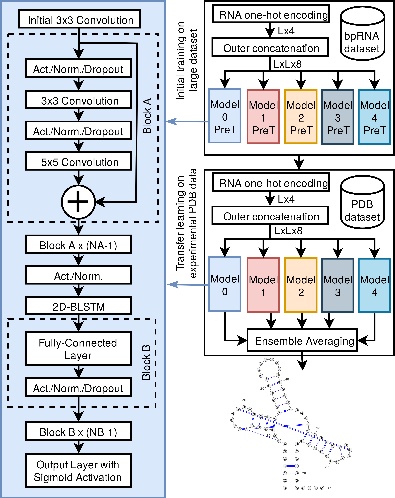

SPOT-RNA: RNA Secondary Structure Prediction using an Ensemble of Two-dimensional Deep Neural Networks and Transfer Learning.
====

OVERVIEW
====
SPOT-RNA is a single sequence-based RNA secondary structure predictor. It used an ensemble of deep learning methods (ResNets and BiLSTM) (Figure 1) to infer the base-pair probability of nucleotides within the sequence. SPOT-RNA was initially trained on non-redundant bpRNA[1] dataset in which secondary structure was derived using comparative sequence analysis. After initial training, transfer learning was used to further train SPOT-RNA on high resolution non-redundant structured RNAs from Protein Data Bank (PDB)[2]. SPOT-RNA can predict all kind of base-pair including pseudoknots, non-canonical, lone, and triplets base-pairs. SPOT-RNA is also available as web-server at http://sparks-lab.org/jaswinder/server/SPOT-RNA/. The web-server provides an arc diagram and a 2D diagram of predicted RNA secondary the structure through Visualization Applet for RNA (VARNA)[3] tool along with a dot plot of SPOT-RNA predicted base-pair
probabilities.

|
|----|
| <p align="center"> <b>Figure 1:</b> The network layout of the SPOT-RNA, where L is the sequence length of a target RNA, Act. indicates the activation function, Norm. indicates the normalization function, and PreT indicates the pretrained (initial trained) models trained on the bpRNA dataset.|

SYSTEM REQUIREMENTS
====
Hardware Requirments:
----
SPOT-RNA predictor requires only a standard computer with around 16 GB RAM to support the in-memory operations for RNAs sequence length less than 500.

Software Requirments:
----
* [Python3](https://docs.python-guide.org/starting/install3/linux/)
* [virtualenv](https://virtualenv.pypa.io/en/latest/installation/) or [Anaconda](https://anaconda.org/anaconda/virtualenv)
* [CUDA 10.0](https://developer.nvidia.com/cuda-10.0-download-archive) (Optional If using GPU)
* [cuDNN (>= 7.4.1)](https://developer.nvidia.com/cudnn) (Optional If using GPU)

SPOT-RNA has been tested on Ubuntu 14.04, 16.04, and 18.04 operating systems.

USAGE
====

Installation:
----

To install SPOT-RNA and it's dependencies following commands can be used in terminal:

1. `git clone https://github.com/jaswindersingh2/SPOT-RNA.git`
2. `cd SPOT-RNA`
3. `wget 'https://www.dropbox.com/s/dsrcf460nbjqpxa/SPOT-RNA-models.tar.gz' || wget -O SPOT-RNA-models.tar.gz 'https://app.nihaocloud.com/f/fbf3315a91d542c0bdc2/?dl=1'`
4. `tar -xvzf SPOT-RNA-models.tar.gz && rm SPOT-RNA-models.tar.gz`

Either follow **virtualenv** column steps or **conda** column steps to create virtual environment and to install SPOT-RNA dependencies given in table below:<br />

|  | &nbsp;&nbsp;&nbsp;&nbsp;&nbsp;&nbsp;&nbsp;&nbsp;&nbsp;&nbsp;&nbsp;&nbsp;&nbsp;&nbsp;&nbsp;&nbsp;&nbsp;&nbsp;&nbsp;&nbsp;&nbsp; virtualenv | &nbsp;&nbsp;&nbsp;&nbsp;&nbsp;&nbsp;&nbsp;&nbsp;&nbsp;&nbsp;&nbsp;&nbsp;&nbsp;&nbsp;&nbsp;&nbsp;&nbsp;&nbsp;&nbsp;&nbsp;&nbsp;&nbsp;&nbsp;&nbsp;&nbsp;&nbsp;&nbsp;&nbsp;&nbsp;&nbsp;&nbsp;&nbsp;&nbsp;&nbsp;&nbsp;&nbsp; conda |
| :- | :-------- | :--- |
| 5. | `virtualenv -p python3.6 venv` | `conda create -n venv python=3.6` |
| 6. | `source ./venv/bin/activate` | `conda activate venv` | 
| 7. | *To run SPOT-RNA on CPU:*<br /> <br /> `pip install tensorflow==1.14.0` <br /> <br /> &nbsp;&nbsp;&nbsp;&nbsp;&nbsp;&nbsp;&nbsp;&nbsp;&nbsp;&nbsp;&nbsp;&nbsp;&nbsp;&nbsp;&nbsp;&nbsp;&nbsp;&nbsp;&nbsp;&nbsp;&nbsp;&nbsp;&nbsp;&nbsp; *or* <br /> <br />*To run SPOT-RNA on GPU:*<br /> <br /> `pip install tensorflow-gpu==1.14.0` | *To run SPOT-RNA on CPU:*<br /> <br /> `conda install tensorflow==1.14.0` <br /> <br /> &nbsp;&nbsp;&nbsp;&nbsp;&nbsp;&nbsp;&nbsp;&nbsp;&nbsp;&nbsp;&nbsp;&nbsp;&nbsp;&nbsp;&nbsp;&nbsp;&nbsp;&nbsp;&nbsp;&nbsp;&nbsp;&nbsp;&nbsp;&nbsp; *or* <br /> <br />*To run SPOT-RNA on GPU:*<br /> <br /> `conda install tensorflow-gpu==1.14.0` |
| 8. | `pip install -r requirements.txt` | `while read p; do conda install --yes $p; done < requirements.txt` | 

To run the SPOT-RNA
-----

**For single sequence:**
```
python3 SPOT-RNA.py  --inputs sample_inputs/single_seq.fasta  --outputs 'outputs/'
```
The output come of above command will be three files (.bpseq, .ct, and .prob) in 'outputs' folder. The '.bpseq' and '.ct' file is the standard format to represent RNA secondary structure. '.prob' file consists of the base-pair probability of predicted secondary structure by SPOT-RNA which can be useful for plotting PR-curve and to check the confidence of predicted base-pair.

**For batch of sequences:**
```
python3 SPOT-RNA.py  --inputs sample_inputs/batch_seq.fasta  --outputs 'outputs/'
```

**To run on GPU:**

SPOT-RNA can be run on GPU by setting '--GPU' argument to GPU's number in the system. Specify '0' if only a single GPU is available. Running SPOT-RNA on GPU reduces the computation time of prediction by almost 15 times.
```
python3 SPOT-RNA.py  --inputs sample_inputs/batch_seq.fasta  --outputs 'outputs/' --gpu 0
```

**2D plots of predicted secondary structure:**

To get the 2D plots of SPOT-RNA output, VARNA[3] tool is used. Please refer to http://varna.lri.fr/ for detailed information about this tool. To run this tool, please make sure Java plugin version >= 1.6 is installed in the system. To check whether java is installed or not, the following command can be used.
```
java -version
```
If java is not installed above command will not show anything. To install java in the system following command can be used.
```
sudo apt install default-jre && sudo apt install openjdk-11-jre-headless
```
After java install, the following command can be used to get SPOT-RNA output with 2D plots of predicted secondary structure.
```
python3 SPOT-RNA.py  --inputs sample_inputs/single_seq.fasta  --outputs 'outputs/' --plots True
```
The output of the above command will generate two additional files (arc plot and 2D plot of predicted secondary structure) along with '.bpseq', '.ct', and '.prob' files in 'outputs' folder.

**Secondary structure motifs from predicted structure:**

To get the secondary structure motifs like stem, helix, loops from the predicted structure, SPOT-RNA used the software tool from bpRNA[1].  Please refer to https://github.com/hendrixlab/bpRNA for detailed information about this tool. To run this script, please make sure 'Graph.pm' module (https://metacpan.org/pod/Graph) of Perl is installed in the system. To check whether 'Graph' module already installed or not, use the following command:
```
perl -e 'use Graph;'
```
If the output of this command looks like *'Can't locate Graph.pm in @INC (you may need to install the Graph module) (@INC contains: .........'* then the following command can be used to install this module:
```
sudo apt install cpanminus && sudo cpanm Graph
```

After the 'Graph' module install, the following command can be used to get SPOT-RNA output with secondary structure motifs:
```
python3 SPOT-RNA.py  --inputs sample_inputs/single_seq.fasta  --outputs 'outputs/' --plots True --motifs True
```
The output of the above command will generate one additional file '.st' in 'outputs' folder.

Datasets Used For Training, Validation, and Testing
====

The following datasets were used for Initial Training:
* bpRNA[1]: Initial Learning (Training TR0, validation VL0, and test TS0)  
[Dropbox](https://www.dropbox.com/s/w3kc4iro8ztbf3m/bpRNA_dataset.zip) or [Nihao Cloud](https://app.nihaocloud.com/d/26df85ca06bc4eae8f6f/)


The following datasets were used for Transfer Learning:
* PDB[2]: Transfer Learning (Training TR1, validation VL1, and test TS1)  
[Dropbox](https://www.dropbox.com/s/vnq0k9dg7vynu3q/PDB_dataset.zip?dl=0) or [Nihao Cloud](https://app.nihaocloud.com/f/d61638e03bc5484f8f83/)

References
====
If you use SPOT-RNA for your research please cite the following papers:
----
Singh, J., Hanson, J., Paliwal, K., Zhou, Y. RNA secondary structure prediction using an ensemble of two-dimensional deep neural networks and transfer learning. Nat Commun 10, 5407 (2019) https://doi.org/10.1038/s41467-019-13395-9

Other references:
----
[1] Padideh Danaee, Mason Rouches, Michelle Wiley, Dezhong Deng, Liang Huang, David Hendrix, bpRNA: large-scale automated annotation and analysis of RNA secondary structure, Nucleic Acids Research, Volume 46, Issue 11, 20 June 2018, Pages 5381–5394, https://doi.org/10.1093/nar/gky285

[2] H.M. Berman, J. Westbrook, Z. Feng, G. Gilliland, T.N. Bhat, H. Weissig, I.N. Shindyalov, P.E. Bourne.
(2000) The Protein Data Bank Nucleic Acids Research, 28: 235-242.

[3]  VARNA: Interactive drawing and editing of the RNA secondary structure Kévin Darty, Alain Denise and Yann Ponty Bioinformatics, pp. 1974-1975, Vol. 25, no. 15, 2009 


Licence
====
Mozilla Public License 2.0


Contact
====
jaswinder.singh3@griffithuni.edu.au, yaoqi.zhou@griffith.edu.au
